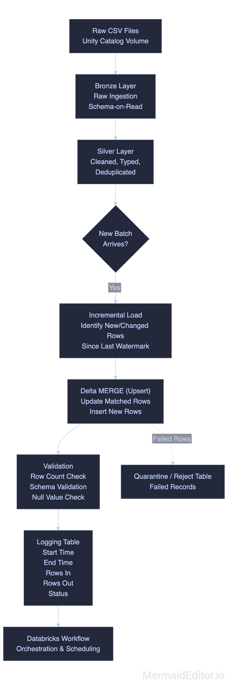
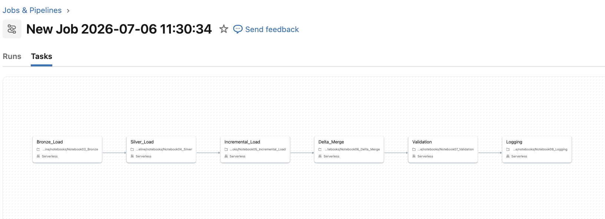
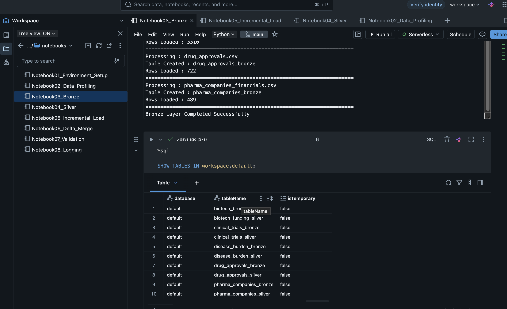
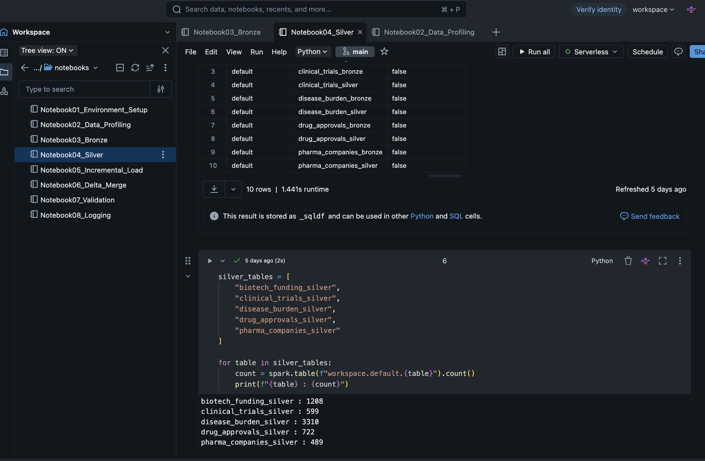
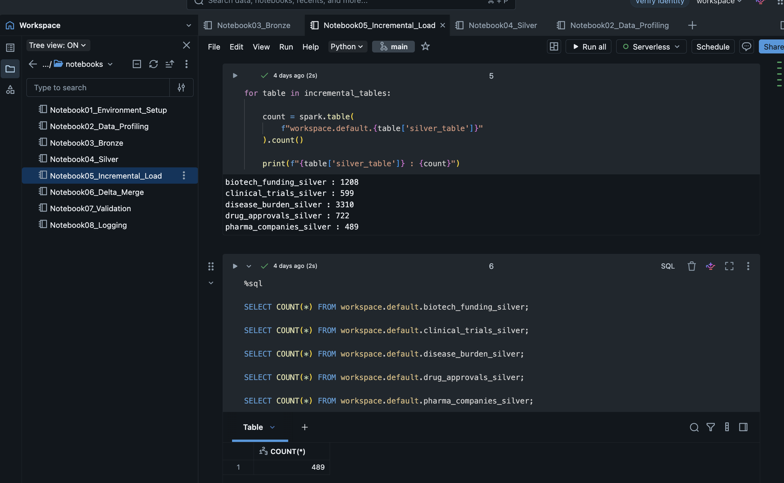
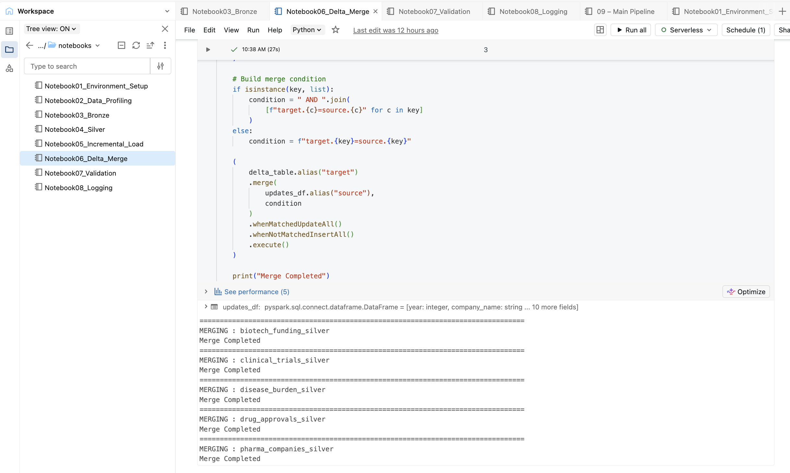
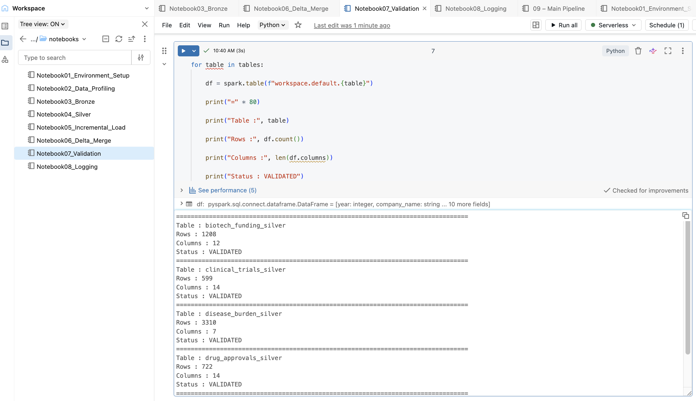
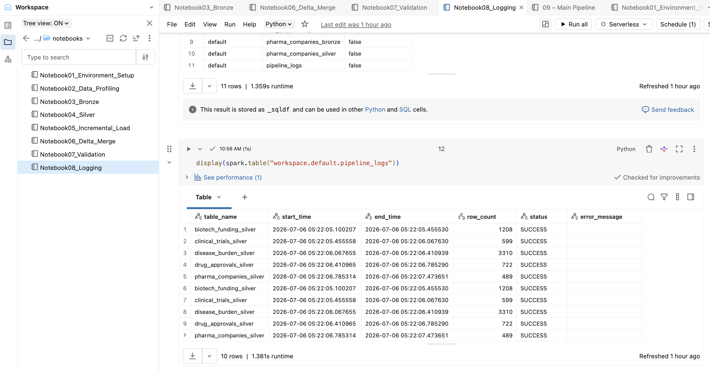

# Healthcare_Pharma_Data_Pipeline
End-to-end Healthcare &amp; Pharma Data Pipeline built using Databricks, PySpark, Delta Lake, and Unity Catalog. Processes multiple CSV files with Bronze/Silver architecture, Incremental Load, Delta Merge (Upsert), Validation, Logging, and Workflow automation.

---

# 📌 Project Overview

This project demonstrates a complete **Data Engineering ETL pipeline** built on **Databricks** using **PySpark** and **Delta Lake**.

The pipeline ingests multiple healthcare and pharmaceutical CSV datasets, processes them through Bronze and Silver layers, performs Incremental Loading and Delta Merge (Upsert), validates the processed data, logs execution details, and automates the entire workflow using Databricks Workflows.

The project follows modern Data Engineering best practices and demonstrates scalable data ingestion and transformation techniques.

---

# 🚀 Project Objectives

- Read multiple CSV files using PySpark
- Store raw data into Delta Bronze tables
- Clean and transform data into Silver tables
- Perform Incremental Loading
- Perform Delta Merge (Upsert)
- Validate processed data
- Log pipeline execution details
- Automate the pipeline using Databricks Workflows

---

# 🛠️ Technology Stack

| Technology | Purpose |
|------------|---------|
| Databricks | Cloud Data Engineering Platform |
| PySpark | Distributed Data Processing |
| Delta Lake | ACID Transactional Storage |
| Unity Catalog | Data Governance & Storage |
| Python | ETL Development |
| SQL | Data Validation |
| Databricks Workflows | Pipeline Automation |

---

# 📂 Dataset

The pipeline processes the following healthcare datasets:

| Dataset |
|----------|
| biotech_funding.csv |
| clinical_trials.csv |
| disease_burden.csv |
| drug_approvals.csv |
| pharma_companies_financials.csv |

---

# 🏗️ Pipeline Architecture



---

# 📁 Project Structure

```text
Healthcare_Pharma_Data_Pipeline
│
├── notebooks
│   ├── Notebook01_Environment_Setup
│   ├── Notebook02_Data_Profiling
│   ├── Notebook03_Bronze_Load
│   ├── Notebook04_Silver_Load
│   ├── Notebook05_Incremental_Load
│   ├── Notebook06_Delta_Merge
│   ├── Notebook07_Validation
│   └── Notebook08_Logging
│
│
├── docs
│
├── screenshots
│
├── README.md
│
└── LICENSE
```

---

# 🔄 ETL Workflow

## Notebook 01 – Environment Setup

- Initialize Spark Session
- Configure Unity Catalog
- Verify Volumes
- Prepare Environment

---

## Notebook 02 – Data Profiling

- Read CSV Files
- Explore Schema
- Identify Null Values
- Profile Data

---

## Notebook 03 – Bronze Layer

- Read all CSV files
- Create Bronze Delta Tables
- Overwrite Existing Tables
- Validate Data Load

---

## Notebook 04 – Silver Layer

- Read Bronze Tables
- Clean Data
- Handle Missing Values
- Standardize Data Types
- Create Silver Delta Tables

---

## Notebook 05 – Incremental Loading

- Read Latest Source Files
- Compare Against Silver Tables
- Identify New Records
- Append Incremental Data

---

## Notebook 06 – Delta Merge (Upsert)

- Merge Source with Target
- Update Existing Records
- Insert New Records
- Maintain Data Consistency

---

## Notebook 07 – Validation

- Validate Row Counts
- Verify Table Schemas
- Compare Source & Target
- Ensure Data Quality

---

## Notebook 08 – Logging

- Capture Pipeline Start Time
- Capture End Time
- Record Row Counts
- Store Execution Status
- Maintain Pipeline Logs


---

## 📊 Data Model


### Bronze Layer

| Table | Purpose |
|--------|---------|
| biotech_funding_bronze | Stores raw biotechnology funding data ingested from CSV files. |
| clinical_trials_bronze | Stores raw clinical trial records from the source dataset. |
| disease_burden_bronze | Stores raw disease burden statistics without transformation. |
| drug_approvals_bronze | Stores raw drug approval records loaded from CSV files. |
| pharma_companies_bronze | Stores raw pharmaceutical company financial data. |

### Silver Layer

| Table | Purpose |
|--------|---------|
| biotech_funding_silver | Stores cleaned and standardized biotechnology funding data. |
| clinical_trials_silver | Stores validated and transformed clinical trial data. |
| disease_burden_silver | Stores cleaned disease burden data for analytics. |
| drug_approvals_silver | Stores standardized drug approval information. |
| pharma_companies_silver | Stores cleaned financial data of pharmaceutical companies. |

----

## 📑 Key Columns

### biotech_funding_silver

| Column | Description |
|---------|-------------|
| deal_id | Unique identifier for each funding deal. |
| company_name | Name of the biotechnology company. |
| funding_amount | Funding amount received in USD. |
| source_file | Source CSV filename. |
| load_timestamp | Timestamp when the record was loaded into Delta Lake. |

### clinical_trials_silver

| Column | Description |
|---------|-------------|
| trial_id | Unique clinical trial identifier. |
| sponsor | Organization sponsoring the clinical trial. |
| phase | Clinical trial phase. |
| status | Trial status. |
| load_timestamp | Record ingestion timestamp. |

----
## 🎯 Learning Applied

This project demonstrates the practical application of Data Engineering concepts learned through Databricks and PySpark.

- Designed a Medallion Architecture using Bronze and Silver layers.
- Loaded raw CSV datasets into Delta Lake tables using PySpark.
- Performed data profiling and schema validation.
- Implemented data cleaning and transformation using PySpark DataFrames.
- Developed an Incremental Load process to ingest only new records.
- Applied Delta MERGE (UPSERT) to update existing records and insert new records efficiently.
- Validated processed data using row count, schema, and null value checks.
- Implemented pipeline logging to monitor execution status, processing time, and row counts.
- Managed data using Unity Catalog Volumes and Delta Tables.
- Organized the ETL process into modular notebooks for better maintainability and scalability.
----

# 📊 Features

- ✅ Multi-file CSV Processing
- ✅ Delta Lake Storage
- ✅ Bronze & Silver Architecture
- ✅ Incremental Data Loading
- ✅ Delta Merge (Upsert)
- ✅ Data Validation
- ✅ Pipeline Logging
- ✅ Databricks Workflow Automation
- ✅ Modular Notebook Design

---

# 📷 Project Screenshots

## Workflow Execution

<br>



---

## Bronze Delta Tables

<br>



---

## Silver Delta Tables

<br>



---

## Incremental load

<br>





---

## Delta Merge 
<br>



----

## Validation Results

<br>




---

## Pipeline Logs

<br>



---

# ▶️ How to Run

1. Upload the CSV files to Unity Catalog Volume.
2. Run **Notebook01_Environment_Setup**.
3. Run **Notebook02_Data_Profiling**.
4. Execute **Notebook03_Bronze_Load**.
5. Execute **Notebook04_Silver_Load**.
6. Run **Notebook05_Incremental_Load**.
7. Execute **Notebook06_Delta_Merge**.
8. Run **Notebook07_Validation**.
9. Execute **Notebook08_Logging**.
10. Automate the entire pipeline using **Databricks Workflows**.

---

# 📈 Skills Demonstrated

- Data Engineering
- ETL Pipeline Development
- PySpark
- Delta Lake
- Databricks
- SQL
- Incremental Data Processing
- Upsert (Merge)
- Data Validation
- Workflow Automation
- Unity Catalog

---

# 🚀 Future Enhancements

- Implement Gold Layer for Business Analytics
- Integrate Auto Loader
- Add Delta Live Tables (DLT)
- Schedule Daily Pipeline Runs
- Integrate Cloud Object Storage (Azure Data Lake)
- Add Monitoring & Alerts

---

## ⭐ If you found this project helpful, consider giving it a Star!
